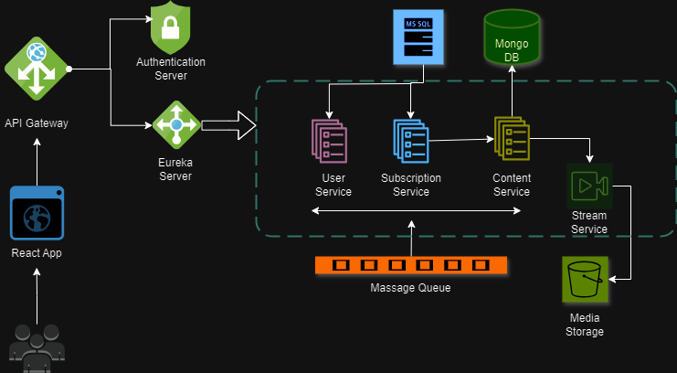

# CourseShare: Online Learning Platform

**CourseShare** is a comprehensive online learning platform designed to offer users a wide range of courses for self-paced learning. This full-stack application leverages modern technologies to provide a seamless and efficient user experience.

## 🌐 Technologies Used

### Backend:
- **Microservices Architecture**: Developed using Spring Boot, Spring WebFlux, and Spring Cloud for scalable and resilient service management.
- **Video Streaming**: Implemented with HTTP Live Streaming (HLS) for smooth video delivery.
- **Databases**: Utilizes MongoDB for NoSQL data storage and MySQL for relational data management.
- **Message Queue**: Integrates RabbitMQ for efficient message handling between services.
- **Cloud Services**: Utilizes Amazon S3 for reliable and scalable cloud storage solutions.

### Components:
- **API Gateway Service**: Manages and routes client requests to appropriate services.
- **Authorization Service**: Ensures secure access and authentication.
- **Subscription Service**: Handles user subscriptions and course access.
- **User Service**: Manages user data and profiles.
- **Content Service**: Manages course content and metadata.
- **Streaming Service**: Delivers video content efficiently.
- **Service Registry (Eureka Server)**: Facilitates service discovery and load balancing.

### System Arcitecher:

## ✨ Key Features:
- **📚 Diverse Course Library**: Access a variety of courses tailored for self-paced learning.
- **🎥 Smooth Video Streaming**: Enjoy uninterrupted video lessons with HLS.
- **🔒 User Authentication & Security**: Secure login and access to personalized content.
- **💼 Flexible Subscription Plans**: Choose from various subscription options to suit your learning needs.
- **📝 Author Course Uploads**: Authors can easily upload and manage their own courses.
- **🔍 Course Search**: Efficiently search for courses to find exactly what you need.
